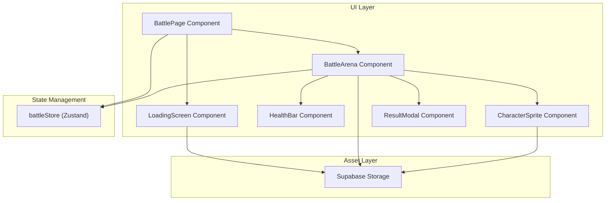
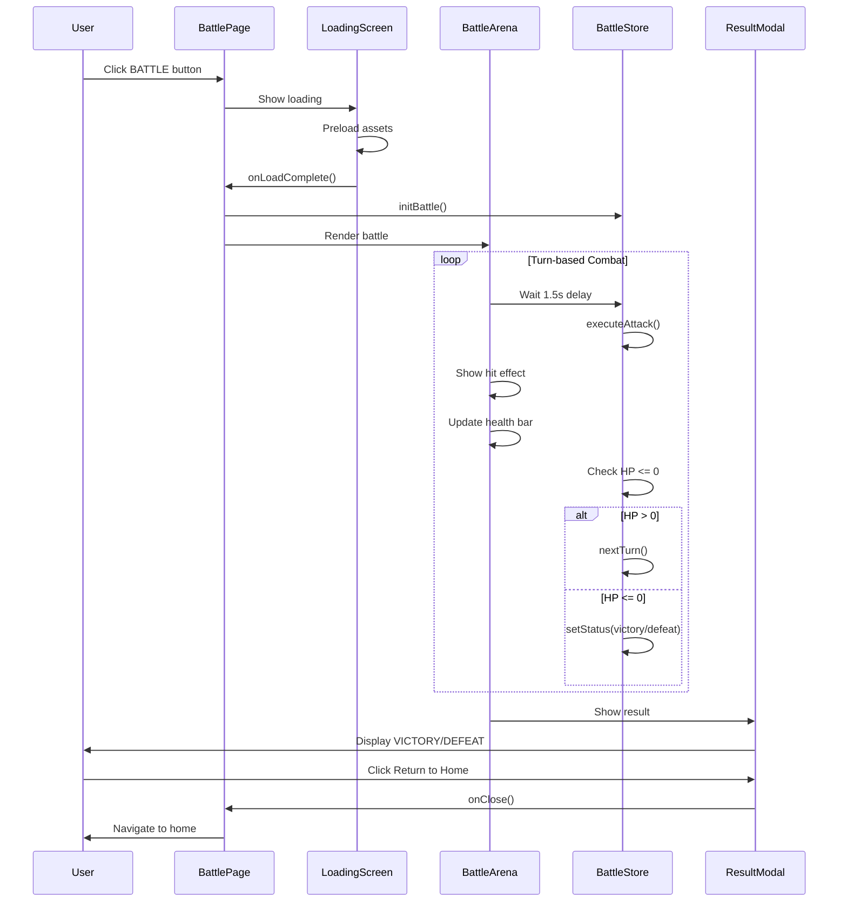

# Design Document: Battle Arena RPG

## Overview

Battle Arena RPG adalah sistem pertarungan turn-based bergaya pixel/8-bit yang terintegrasi dengan game yang sudah ada. Sistem ini menggunakan React components dengan CSS Modules untuk styling, Zustand untuk state management, dan assets dari Supabase Storage.

Fitur utama:
- Loading screen dengan animasi pixel-style
- Battle arena dengan background gladiator dan karakter naga
- Health bar pixel-style dengan animasi smooth
- Turn-based combat dengan delay antar giliran
- Hit effect (red flash + shake) saat karakter terkena serangan
- Result modal dengan auto-redirect ke home

## Architecture



## Components and Interfaces

### 1. BattlePage Component

Entry point untuk battle system. Mengelola flow dari loading → battle → result.

```typescript
interface BattlePageProps {
  onExit: () => void;  // Callback untuk kembali ke home
}

// States:
// - 'loading': Menampilkan LoadingScreen
// - 'battle': Menampilkan BattleArena
// - 'result': Menampilkan ResultModal
```

### 2. LoadingScreen Component

Menampilkan loading indicator pixel-style saat mempersiapkan battle.

```typescript
interface LoadingScreenProps {
  onLoadComplete: () => void;  // Callback saat loading selesai
}

// Features:
// - Preload background image (gladiator.png)
// - Preload character sprite (output-onlinegiftools.gif)
// - Pixel-style loading bar atau spinner
// - Minimum display time: 1.5 seconds
```

### 3. BattleArena Component

Container utama untuk battle scene.

```typescript
interface BattleArenaProps {
  playerStats: CharacterStats;
  enemyStats: CharacterStats;
  currentTurn: 'player' | 'enemy';
  battleStatus: BattleStatus;
  onAttack: () => void;
  onBattleEnd: (result: 'victory' | 'defeat') => void;
}

// Layout:
// - Background: gladiator.png (full screen)
// - Top-left: Player HealthBar
// - Top-right: Enemy HealthBar
// - Left-center: Player CharacterSprite
// - Right-center: Enemy CharacterSprite (mirrored)
// - Center: ResultModal (when battle ends)
```

### 4. HealthBar Component

Pixel-style health bar dengan stats display.

```typescript
interface HealthBarProps {
  characterName: string;
  currentHp: number;
  maxHp: number;
  atk: number;
  position: 'left' | 'right';  // Determines alignment
  isAnimating?: boolean;
}

// Visual Design:
// - Pixel font (Pixelify Sans)
// - 8-bit style border
// - HP bar dengan gradient (green → yellow → red)
// - ATK icon dengan value
```

### 5. CharacterSprite Component

Menampilkan karakter dengan efek hit.

```typescript
interface CharacterSpriteProps {
  spriteUrl: string;
  position: 'left' | 'right';  // Left = player, Right = enemy (mirrored)
  isHit: boolean;  // Triggers red flash + shake
  isAttacking: boolean;  // Triggers attack animation
}

// Effects:
// - Red tint overlay saat isHit = true (300ms)
// - Shake animation saat isHit = true
// - Scale/move animation saat isAttacking = true
```

### 6. ResultModal Component

Modal hasil pertarungan.

```typescript
interface ResultModalProps {
  result: 'victory' | 'defeat';
  onClose: () => void;
  autoCloseDelay?: number;  // Default: 5000ms
}

// Visual Design:
// - Semi-transparent dark overlay
// - Centered modal dengan pixel border
// - "VICTORY" atau "DEFEAT" text (pixel font, large)
// - "Return to Home" button
// - Auto-close countdown indicator
```

## Data Models

### CharacterStats

```typescript
interface CharacterStats {
  name: string;
  currentHp: number;
  maxHp: number;
  atk: number;
}

// Initial values:
// Player: { name: 'Player', currentHp: 500, maxHp: 500, atk: 100 }
// Enemy: { name: 'Enemy', currentHp: 500, maxHp: 500, atk: 50 }
```

### BattleState

```typescript
type BattleStatus = 'loading' | 'ready' | 'in_progress' | 'victory' | 'defeat';

interface BattleState {
  status: BattleStatus;
  currentTurn: 'player' | 'enemy';
  turnCount: number;
  player: CharacterStats;
  enemy: CharacterStats;
  lastDamage: {
    target: 'player' | 'enemy';
    amount: number;
  } | null;
}
```

### Battle Store Actions

```typescript
interface BattleActions {
  // Initialize battle with default stats
  initBattle: () => void;
  
  // Execute attack for current turn
  executeAttack: () => void;
  
  // Switch to next turn
  nextTurn: () => void;
  
  // Set battle status
  setStatus: (status: BattleStatus) => void;
  
  // Reset battle state
  resetBattle: () => void;
}
```

## Battle Flow Sequence



## Asset URLs

Assets diambil dari Supabase Storage menggunakan helper function yang sudah ada:

```typescript
// Background
const backgroundUrl = getStorageUrl('battle/gladiator.png');

// Character sprite (dragon)
const dragonSpriteUrl = getStorageUrl('battle/output-onlinegiftools.gif');
```

## Styling Guidelines

### Pixel-Style Design System

```css
/* Font */
font-family: var(--font-pixelify), 'Press Start 2P', monospace;

/* Colors */
--pixel-green: #00ff00;
--pixel-yellow: #ffff00;
--pixel-red: #ff0000;
--pixel-blue: #0066ff;
--pixel-dark: #1a1a2e;
--pixel-border: #ffffff;

/* Border Style */
border: 3px solid var(--pixel-border);
box-shadow: 
  inset -4px -4px 0 rgba(0,0,0,0.3),
  inset 4px 4px 0 rgba(255,255,255,0.3);

/* Health Bar Gradient */
background: linear-gradient(90deg, 
  var(--pixel-green) 0%, 
  var(--pixel-yellow) 50%, 
  var(--pixel-red) 100%
);
```

### Responsive Breakpoints

```css
/* Mobile */
@media (max-width: 480px) {
  .character { width: 80px; height: 80px; }
  .healthBar { font-size: 10px; }
}

/* Tablet */
@media (min-width: 481px) and (max-width: 768px) {
  .character { width: 120px; height: 120px; }
  .healthBar { font-size: 12px; }
}

/* Desktop */
@media (min-width: 769px) {
  .character { width: 180px; height: 180px; }
  .healthBar { font-size: 14px; }
}
```


## Correctness Properties

*A property is a characteristic or behavior that should hold true across all valid executions of a system—essentially, a formal statement about what the system should do. Properties serve as the bridge between human-readable specifications and machine-verifiable correctness guarantees.*

### Property 1: Attack Damage Calculation

*For any* attack action where attacker has ATK value A and target has current HP value H, executing the attack should result in target's HP becoming exactly H - A (or 0 if H - A < 0).

**Validates: Requirements 4.3, 4.4**

### Property 2: Turn Alternation

*For any* battle state where currentTurn is 'player', after executing an attack and the battle is still in progress, currentTurn should become 'enemy', and vice versa.

**Validates: Requirements 4.5**

### Property 3: Battle Continuation Invariant

*For any* battle state, the battle status should be 'in_progress' if and only if both player.currentHp > 0 AND enemy.currentHp > 0.

**Validates: Requirements 4.6**

### Property 4: Battle Result Determination

*For any* battle state where one character's HP reaches 0:
- If player.currentHp <= 0, then battleStatus should be 'defeat'
- If enemy.currentHp <= 0, then battleStatus should be 'victory'

**Validates: Requirements 6.1, 6.2**

### Property 5: Post-Battle Attack Prevention

*For any* battle state where status is 'victory' or 'defeat', calling executeAttack() should have no effect on either character's HP.

**Validates: Requirements 8.4**

### Property 6: Health Bar Stats Completeness

*For any* CharacterStats object with name, currentHp, maxHp, and atk values, the rendered HealthBar component should display all four values.

**Validates: Requirements 3.3**

### Property 7: HP Bounds Invariant

*For any* battle state, both player.currentHp and enemy.currentHp should always be >= 0 and <= maxHp.

**Validates: Requirements 3.4, 3.5, 4.3, 4.4**

## Error Handling

### Asset Loading Errors

```typescript
// If asset fails to load, show error state and allow retry
interface AssetLoadError {
  type: 'background' | 'sprite';
  url: string;
  error: Error;
}

// Fallback behavior:
// - Show placeholder image
// - Display "Retry" button
// - Log error for debugging
```

### Battle State Errors

```typescript
// Invalid state transitions should be prevented
const validTransitions: Record<BattleStatus, BattleStatus[]> = {
  'loading': ['ready'],
  'ready': ['in_progress'],
  'in_progress': ['victory', 'defeat'],
  'victory': ['loading'],  // Reset for new battle
  'defeat': ['loading'],   // Reset for new battle
};

// If invalid transition attempted, log warning and ignore
```

### Navigation Errors

```typescript
// If navigation to home fails, show error toast and retry
try {
  router.push('/home');
} catch (error) {
  showToast('Failed to return home. Please try again.');
}
```

## Testing Strategy

### Unit Tests

Unit tests akan fokus pada:
- Initial state values (player ATK 100, HP 500; enemy ATK 50, HP 500)
- Component rendering (HealthBar, CharacterSprite, ResultModal)
- UI positioning (left/right alignment)
- CSS class application (hit effect, animations)
- Navigation callbacks

### Property-Based Tests

Property-based tests menggunakan **fast-check** library untuk TypeScript/JavaScript.

Setiap property test harus:
- Menjalankan minimum 100 iterasi
- Menggunakan generator untuk random input
- Reference property dari design document

```typescript
// Example property test structure
import fc from 'fast-check';

describe('Battle System Properties', () => {
  // Feature: battle-arena-rpg, Property 1: Attack Damage Calculation
  it('should correctly calculate damage for any attack', () => {
    fc.assert(
      fc.property(
        fc.integer({ min: 1, max: 200 }),  // ATK
        fc.integer({ min: 1, max: 1000 }), // Target HP
        (atk, targetHp) => {
          const result = calculateDamage(atk, targetHp);
          return result === Math.max(0, targetHp - atk);
        }
      ),
      { numRuns: 100 }
    );
  });
});
```

### Test Coverage Requirements

| Component | Unit Tests | Property Tests |
|-----------|------------|----------------|
| BattleStore | Initial state, actions | Damage calc, turn alternation, battle result |
| HealthBar | Rendering, positioning | Stats completeness |
| CharacterSprite | Rendering, effects | - |
| ResultModal | Rendering, callbacks | - |
| BattlePage | Flow, navigation | - |

### Integration Tests

- Full battle flow: loading → battle → result → home
- Asset preloading verification
- Responsive layout testing
