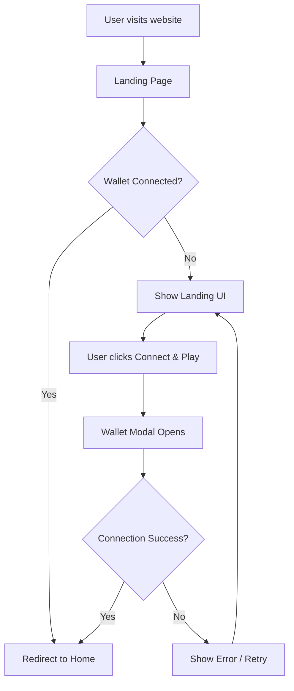
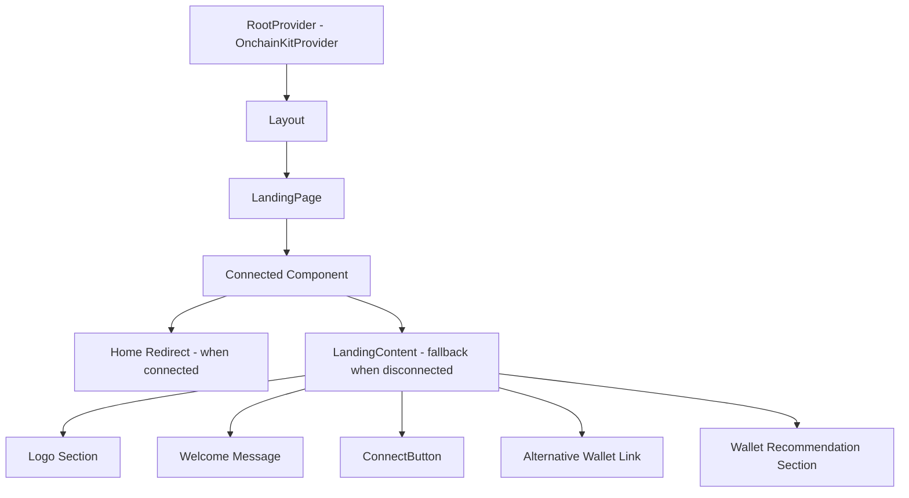

# Design Document: Wallet Login Landing Page

## Overview

Fitur ini mengimplementasikan landing page mobile-first PWA dengan desain pixel art style untuk aplikasi Web3. Landing page akan menampilkan branding logo, tombol connect wallet, dan rekomendasi wallet untuk user baru. Setelah berhasil connect wallet, user akan diarahkan ke halaman home.

Implementasi menggunakan OnchainKit dari Coinbase untuk wallet connection, dengan komponen `Connected` untuk conditional rendering berdasarkan status koneksi wallet.

## Architecture



### Component Hierarchy



## Components and Interfaces

### 1. LandingPage Component (`app/page.tsx`)

Main entry component yang menggunakan `Connected` dari OnchainKit untuk conditional rendering.

```typescript
interface LandingPageProps {
  // No props needed - uses OnchainKit context
}

// Component structure
const LandingPage: React.FC = () => {
  return (
    <Connected
      connecting={<LoadingState />}
      fallback={<LandingContent />}
    >
      <HomeRedirect />
    </Connected>
  );
};
```

### 2. LandingContent Component (`app/components/LandingContent.tsx`)

Komponen yang menampilkan UI landing page ketika wallet belum terkoneksi.

```typescript
interface LandingContentProps {
  // No props - self-contained component
}

// Sections:
// - Logo display (logos_demo.png)
// - Welcome message
// - Connect button (custom styled)
// - Alternative wallet link
// - Wallet recommendation section
```

### 3. ConnectButton Component

Custom styled button yang trigger wallet modal dari OnchainKit.

```typescript
// Uses OnchainKit's ConnectWallet with custom styling
<Wallet>
  <ConnectWallet 
    className="custom-connect-button"
    disconnectedLabel="Connect & Play"
  />
</Wallet>
```

### 4. HomeRedirect Component (`app/components/HomeRedirect.tsx`)

Komponen yang handle redirect ke home page setelah wallet terkoneksi.

```typescript
interface HomeRedirectProps {
  // No props - redirects automatically
}

// Uses Next.js router to redirect to /home
```

### 5. Home Page (`app/home/page.tsx`)

Halaman kosong untuk sementara, akan diisi nanti.

```typescript
const HomePage: React.FC = () => {
  return (
    <div className="home-container">
      {/* Empty for now */}
    </div>
  );
};
```

## Data Models

### Wallet Connection State

OnchainKit mengelola state wallet connection secara internal. Kita menggunakan `Connected` component untuk react terhadap state changes.

```typescript
// OnchainKit internal states:
type WalletStatus = 'disconnected' | 'connecting' | 'connected';

// We access this via Connected component:
// - fallback: rendered when disconnected
// - connecting: rendered when connecting
// - children: rendered when connected
```

### Style Constants

```typescript
// Color palette based on reference design
const COLORS = {
  background: '#1a1a2e',      // Dark navy background
  textPrimary: '#f5f5dc',     // Cream/beige for main text
  textSecondary: '#a0a0a0',   // Gray for secondary text
  buttonPrimary: '#3b82f6',   // Blue for main button
  linkYellow: '#ffd700',      // Gold/yellow for "use another wallet"
  linkBlue: '#60a5fa',        // Light blue for Coinbase link
  border: '#333344',          // Subtle border color
};

// Typography
const TYPOGRAPHY = {
  fontFamily: "'Pixelify Sans', cursive",
  welcomeSize: '1.5rem',
  buttonSize: '1.125rem',
  secondarySize: '0.875rem',
};
```

## Correctness Properties

*A property is a characteristic or behavior that should hold true across all valid executions of a system-essentially, a formal statement about what the system should do. Properties serve as the bridge between human-readable specifications and machine-verifiable correctness guarantees.*

Based on the prework analysis, most acceptance criteria are UI/styling examples that verify specific elements exist. The key behavioral property is the redirect after wallet connection.

### Property 1: Wallet Connection Redirect

*For any* successful wallet connection event, the system SHALL redirect the user to the Home page within a reasonable time frame (< 1 second).

**Validates: Requirements 4.1**

### Property 2: Landing Page Element Presence

*For any* initial page load when wallet is disconnected, the landing page SHALL contain all required elements: logo image, welcome message, connect button, alternative wallet link, and wallet recommendation section.

**Validates: Requirements 1.1, 1.2, 2.1, 2.4, 3.1, 3.2, 3.3**

### Property 3: Loading State Display

*For any* wallet connection attempt in progress, the landing page SHALL display a loading indicator instead of the connect button.

**Validates: Requirements 4.3**

## Error Handling

### Wallet Connection Errors

1. **Connection Rejected**: User menolak connection request di wallet
   - Display: Kembali ke landing page dengan state normal
   - Action: User dapat mencoba connect lagi

2. **Network Error**: Gagal connect ke blockchain network
   - Display: Error message dengan opsi retry
   - Action: Tampilkan tombol "Try Again"

3. **Unsupported Wallet**: Wallet tidak didukung
   - Display: Pesan untuk menggunakan wallet yang didukung
   - Action: Tampilkan link ke Coinbase Smart Wallet

### UI Error States

```typescript
// Error state handling in LandingContent
const handleConnectionError = (error: Error) => {
  // OnchainKit handles most errors internally
  // We just need to ensure fallback UI is shown
  console.error('Wallet connection error:', error);
};
```

## Testing Strategy

### Unit Tests

Unit tests akan memverifikasi:
- LandingContent component renders semua elemen yang diperlukan
- ConnectButton component memiliki styling yang benar
- HomeRedirect component melakukan redirect dengan benar

### Property-Based Tests

Property-based testing akan digunakan untuk:
- **Property 1**: Test redirect behavior dengan berbagai wallet connection scenarios
- **Property 2**: Test element presence dengan berbagai viewport sizes (mobile, tablet, desktop)

### Integration Tests

Integration tests akan memverifikasi:
- Full flow dari landing page ke home page setelah wallet connection
- Wallet modal muncul ketika tombol connect diklik
- Loading state ditampilkan selama connection process

### Testing Framework

- **Unit/Integration Tests**: Jest + React Testing Library
- **Property-Based Tests**: fast-check (jika diperlukan untuk complex scenarios)
- **E2E Tests**: Playwright (optional untuk full flow testing)

### Test Configuration

```typescript
// Minimum 100 iterations untuk property tests
// Tag format: Feature: wallet-login-landing, Property N: description
```

## Implementation Notes

### Font Loading

Pixelify Sans akan di-load menggunakan Next.js font optimization:

```typescript
// app/layout.tsx
import { Pixelify_Sans } from 'next/font/google';

const pixelifySans = Pixelify_Sans({
  subsets: ['latin'],
  variable: '--font-pixelify',
});
```

### PWA Configuration

Untuk PWA support, perlu ditambahkan:
- `manifest.json` di folder public
- Viewport meta tag di layout
- Theme color meta tag

### OnchainKit Configuration

Update `rootProvider.tsx` untuk custom appearance:

```typescript
config={{
  appearance: {
    mode: 'dark',
    theme: 'default',
  },
  wallet: {
    display: 'modal',
    preference: 'all',
  },
}}
```

### File Structure

```
app/
├── page.tsx              # Landing page (updated)
├── layout.tsx            # Root layout with font
├── globals.css           # Global styles (updated)
├── components/
│   ├── LandingContent.tsx
│   └── HomeRedirect.tsx
└── home/
    └── page.tsx          # Empty home page
```

